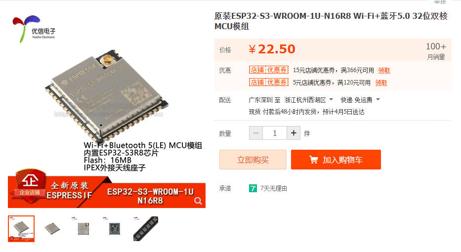

# ElectronBot尝试移植到ESP32S3记录

**IIC驱动舵机已完成，缓慢ing...**

# 1、硬件部分

目前使用ESP32S3WROOM-1U-N16R8

立创开源链接：https://oshwhub.com/txp666/electronbot_study

# 2、软件部分

使用VScode和PlatformIO开发：在boards文件夹下面的js文件可修改自己的ESP32型号，Flash大小。

目前成功移植了IIC舵机驱动。

**23/4/9更新**：移植lvgl循环播放笑脸动图，目前屏幕与舵机都可正常使用，可以组装完成一个初级的脱机机器人

<video id="video" controls="" preload="none">
    <source id="mp4" src="./Images/1.mp4" type="video/mp4">
</video>

